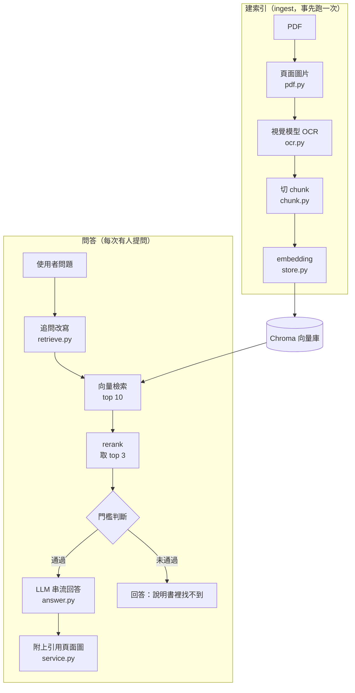

# 技術說明：從掃描版 PDF 到手機問答

這份文件說明系統怎麼運作、為什麼這樣設計、怎麼測試，以及開發過程中踩過的坑。使用方式請看 [README](../README.md)。

## 要解決的問題

家裡冷氣的說明書是**掃描版 PDF**：21 頁全是圖片、沒有文字層，內容又大量依賴遙控器按鍵圖示（「按 (快速) 鍵」）和表格。目標是讓家人用手機直接問「想讓房間快點變涼要怎麼做？」，得到有根據的回答，並附上說明書原頁圖片對照遙控器。

刻意**手寫 RAG 管線、不用 LangChain / LlamaIndex**：這個專案的主要目的是弄懂 RAG 每一步在做什麼。每個步驟是一個小模組，出問題時能直接定位，也能單獨替換或調參。而且「掃描 PDF + 視覺 OCR」本來就不是框架的標準流程，用框架還是要自己寫客製元件。

## 整體架構

RAG 分兩個階段：



使用的模型（皆為免費 API，型號寫在 `rag/config.py`，可用 `.env` 覆寫）：

| 用途 | 平台 | 模型 |
|---|---|---|
| OCR（看圖轉文字） | Google AI Studio | gemini-3.x-flash |
| 聊天（改寫問題、生成回答） | NVIDIA NIM | z-ai/glm-5.3-flash |
| Embedding | NVIDIA NIM | nvidia/nemotron-3-embed-1b |
| Rerank | NVIDIA NIM | nvidia/llama-nemotron-rerank-vl-1b-v2 |

所有模型呼叫集中在 `rag/llm.py`，都走 OpenAI 相容格式，換平台只需要換網址和 key。

## 建索引：資料怎麼變成可搜尋的

以說明書 PDF 第 11 頁（強力運轉／鎖定設定）為例。

**1. PDF → 頁面圖片**（`rag/pdf.py`）

每頁轉成 150 DPI 的 PNG，幾乎全白的頁面自動跳過。這些圖片有兩個用途：給視覺模型 OCR，以及回答時顯示給家人看。

**2. 圖片 → 文字：用視覺模型（VLM）做 OCR**（`rag/ocr.py`）

傳統 OCR 只會「認字」：圓圈裡的「快速」會變成普通的兩個字，表格會散成零碎的行。VLM 能照 prompt 的規則整理版面：

| 原文內容 | 轉寫成 |
|---|---|
| 頁面底部的頁碼 | 第一行 `頁碼：9` |
| 大標題 | `## 強力運轉` |
| 按鍵圖示 | `【快速】`、`【取消】`、`【運轉/停止】` |
| 表格 | Markdown 表格 |
| 示意圖 | `[圖：遙控器操作示意]` |

統一用【】標按鍵，讓「快速鍵是幹嘛的」這類問題能精準檢索到。實際輸出：

```markdown
頁碼：9
分類：強力運轉／鎖定設定 運轉的方式

## 強力運轉

■ 在運轉中（自動・暖氣・除濕・冷氣），可按【快速】鍵進行強力運轉。

1 運轉中按【快速】鍵
● 有“嗶”的受信音後，開始運轉。
...
```

OCR 結果存成 `data/ocr/<doc_id>/pNN.md`，**可以人工修正**；已經存在的頁面重跑時會跳過，所以修正不會被覆蓋，也不會重複花 API 額度。

**3. 切 chunk**（`rag/chunk.py`）

說明書一頁通常有好幾個獨立主題（第 11 頁就有「強力運轉」和「鎖定設定」），所以預設**依 `##` 標題切**，每個 chunk 剛好是一個完整的操作說明；太長（約 800 字以上）才再依段落切。

每個 chunk 前面加上**脈絡前綴**，讓 embedding 知道這段在講什麼：

```
客廳冷氣 > 運轉的方式 > 強力運轉
在運轉中（自動・暖氣・除濕・冷氣），可按【快速】鍵進行強力運轉。...
```

切法可以換成「整頁」或「固定字數」，用 eval 比較哪種檢索比較準。

**4. Embedding → Chroma**（`rag/store.py`）

每個 chunk 轉成向量，連同 metadata 存進 Chroma：

| metadata | 用途 |
|---|---|
| `doc_id`、`doc_name` | 哪本說明書（之後加臥室冷氣、洗衣機時用來區分） |
| `pdf_page` | PDF 頁序，用來找對應的頁面圖片 |
| `printed_page` | 說明書上印的頁碼，回答時引用 |
| `section` | 章節標題 |

**為什麼要存兩個頁碼？** PDF 前面有封面、空白頁，PDF 第 11 頁印的其實是「9」。回答引用印刷頁碼，家人拿紙本對照才找得到；程式內部用 PDF 頁序找圖。

重跑 ingest 時會先刪掉該說明書的舊 chunk 再寫入，所以結果是冪等的：跑幾次都一樣。

## 問答：一個問題經過哪些步驟

以「想讓房間快點變涼要怎麼做？」為例。注意問題裡**沒有**「強力運轉」這幾個字，要靠語意檢索。

**1. 追問改寫（query rewriting）**

如果是追問，例如上一題問完再問「那要怎麼取消？」，單獨拿去檢索什麼都找不到。有對話紀錄時，先請 LLM 改寫成完整的問題。實際結果：「要如何取消冷氣的強力運轉（快速運轉）？」

**2. 向量檢索 → rerank**

問題轉成向量，從 Chroma 撈出最相近的 10 段，再交給 reranker 重新排序、取前 3 名。實際的檢索細節（網頁上展開「🔍 檢索細節」就看得到）：

| rerank 名次 | 分數 | 向量名次 | 段落 |
|---|---|---|---|
| 1 | -2.96 | **9** | 強力運轉的內容 |
| 2 | -3.63 | 4 | 強力運轉 |
| 3 | -3.78 | 10 | 除濕運轉 |

最相關的「強力運轉的內容」在向量檢索只排**第 9 名**，rerank 後變**第 1 名**。向量檢索是把問題和段落各自轉成向量再比距離，快但粗；reranker 把「問題 + 段落」放在一起逐一判斷相關性，準很多但慢。所以先用向量檢索縮小範圍，再對前 10 名 rerank。

**3. 門檻判斷**

rerank 最高分低於門檻，就直接回「說明書裡找不到相關內容」，**不呼叫 LLM**，避免它根據不相關的段落亂編。

**4. 生成回答**

把 3 段內容連同頁碼交給 LLM，system prompt 規定：
- 只能根據提供的段落回答，沒寫就說「說明書裡沒有提到」
- 操作步驟條列、按鍵保留【】格式
- 每個重點標註頁碼（第 9 頁）
- 涉及拆機、漏水、電線等問題，提醒聯絡專業人員

回答用串流輸出，字會一個個出現。

**5. 附上原頁圖片**

從回答裡解析引用的頁碼（「第 9 頁」），**只在這次檢索到的段落範圍內**對應回 PDF 頁序，顯示那頁的掃描圖。解析不到就用 rerank 第一名的頁面。

**兩道防亂編的防線**：門檻是第一道，system prompt 是第二道。目前門檻還沒用完整題庫調好，「冷氣可以烘衣服嗎？」這類問題實際上是靠第二道擋下的（LLM 回答「說明書裡沒有提到」）。

## 程式結構

```
ac-manual-rag/
├── rag/
│   ├── config.py      所有設定與預設值，可用 .env 覆寫
│   ├── manuals.py     讀說明書登記表 manuals/manuals.yaml
│   ├── llm.py         所有模型 API 呼叫：OCR、聊天、embedding、rerank、重試與限流
│   ├── pdf.py         PDF → 頁面圖片、空白頁偵測
│   ├── ocr.py         圖片 → Markdown、解析 OCR 檔
│   ├── chunk.py       Markdown → chunks（heading / page / fixed 三種策略）
│   ├── store.py       Chroma 向量庫讀寫
│   ├── retrieve.py    追問改寫、向量檢索、rerank、門檻判斷
│   ├── answer.py      組 prompt、串流生成、解析引用頁碼
│   └── service.py     串起一次問答 + 錯誤處理 + 檢索細節
├── ingest.py          建索引入口：依序呼叫 pdf → ocr → chunk → store
├── app.py             Gradio 網頁介面（只負責顯示，邏輯都在 service.py）
├── eval/              檢索品質評估工具與題庫
├── scripts/           probe_models.py：實際呼叫每個模型，確認可用
└── tests/             99 個單元測試
```

`ingest.py` 和 `app.py` 本身幾乎不做事，只負責依序呼叫各模組。每個模組只做一件事，所以可以單獨測試，也可以單獨替換，例如換 embedding 模型只動一個設定。

### Docker

同一個 image 提供三個 compose service，只差啟動指令：

| service | 用途 | 啟動方式 |
|---|---|---|
| `app` | 問答網頁，常駐 | `docker compose up app` |
| `ingest` | 建索引，一次性 | `docker compose run --rm ingest` |
| `test` | 跑測試，掛載整個專案，改程式不用重新 build | `docker compose run --rm test` |

`manuals/`、`data/`、`eval/` 用 bind mount 掛進 container，所以 container 刪掉資料也還在。API key 透過 `.env` 在執行時傳入，不會打包進 image，也不進 git。

## 測試怎麼設計

**原則：單元測試不連網、結果固定。** 真實 API 會下架、會塞車、要花額度，如果測試依賴它，失敗時分不出是程式壞了還是網路的問題。所以分成三層：

| 層次 | 測什麼 | 工具 |
|---|---|---|
| 單元測試（99 個） | 我們寫的程式邏輯對不對 | pytest + 假模型 |
| 探測腳本 | 外部模型現在能不能用 | `scripts/probe_models.py`，實際呼叫一次 |
| Eval | 檢索品質好不好 | `eval/`，用題庫算命中率 |

所有功能都是先寫測試、確認它**因為功能還沒做而失敗**，才寫實作（TDD）。先看到測試失敗，才能證明這個測試真的抓得到問題。

### 各模組測了什麼

| 測試檔 | 測試數 | 重點 |
|---|---|---|
| `test_config.py` | 12 | 缺 API key 給清楚的錯誤、`.env` 覆寫、數值格式錯誤、**印出設定時不會洩漏 key** |
| `test_manuals.py` | 6 | 登記表格式錯誤、doc_id 不合法或重複、PDF 不存在 |
| `test_llm.py` | 17 | embedding 分批且保持順序、rerank 依分數排序、遇到 429 指數退避重試、401 直接失敗、限流間隔、**OCR 輸出被截斷時視為失敗**、OCR 可走獨立平台 |
| `test_pdf.py` | 6 | 空白頁偵測（容忍掃描雜點）、跳過空白頁、已轉好的圖片不重轉 |
| `test_ocr.py` | 11 | 去掉模型多包的 \`\`\` 、容忍 Windows 換行（CRLF）與全形數字、已存在的頁面跳過、一頁失敗不影響其他頁、**真的有並行**、**中斷時不留下寫一半的檔案** |
| `test_chunk.py` | 8 | 依標題切、標題前的文字不遺漏、長段落依段落切、超長段落硬切、三種策略 |
| `test_store.py` | 5 | 最近鄰查詢與 metadata 還原、重建只影響該說明書、依說明書過濾、空資料庫、資料持久化 |
| `test_ingest.py` | 4 | 端到端建索引、**重跑保留人工修正且不重新 OCR**、部分頁面失敗其他照常建立 |
| `test_retrieve.py` | 7 | 沒對話紀錄不改寫、只取最近 3 輪、rerank 取前 k 並記錄向量名次、低於門檻判定找不到、空資料庫不呼叫 rerank |
| `test_answer.py` | 8 | prompt 標註頁碼、印刷頁碼對應回 PDF 頁序、「PDF 第 3 頁」不會被誤認成印刷頁碼 3、對不上時退回第一名 |
| `test_service.py` | 8 | 串流回答並附圖、用改寫後的問題檢索、找不到時不呼叫 LLM、**API 失敗時回友善訊息、App 不當掉**、空白問題忽略 |
| `test_eval.py` | 6 | 題庫讀取、命中與拒答的判定、統計輸出 |
| `test_app.py` | 1 | 介面能正常建立 |

### 幾個測試技巧

**假模型 `FakeLLM`**（`tests/fakes.py`）：跟真的 client 有一樣的方法，但回傳預先設定的結果，並記錄被呼叫了哪些方法。可以設定某個方法丟錯誤，模擬 API 失敗。例如「找不到時不呼叫 LLM」，就是檢查 `"chat_stream" not in llm.calls`。

**假 HTTP 回應 `httpx.MockTransport`**：rerank 是直接打 HTTP，用它模擬「先回兩次 429、第三次成功」，驗證重試和退避秒數（`sleeps == [1, 2]`）。等待的函式也是注入的，所以測試不用真的等。

**用 `threading.Barrier` 證明真的有並行**：OCR 改成多執行緒後，結果一樣是對的，一般測試抓不出「其實還是一頁一頁做」。Barrier 像一扇要湊滿人數才開的門：假模型每次 OCR 都要過這扇門，兩個呼叫**同時**到才會放行；如果程式其實是循序執行，第二個永遠不會來，5 秒後逾時失敗。

**用 `monkeypatch` 模擬中斷**：把 `os.replace`（改名）換成會丟錯的函式，模擬「暫存檔寫好了、改名前程式掛掉」，確認正式的 `.md` 不存在，下次重跑才不會誤以為已完成。

**`tmp_path` 與 fixture**：每個測試都在 pytest 給的臨時資料夾裡操作，不會碰到真正的 `data/`。共用的 `settings` fixture 把路徑指到臨時資料夾，並固定 `ocr_workers=1`，因為 `FakeLLM` 是依呼叫順序回傳結果，並行會讓順序不固定。

### Eval：量化檢索品質

`eval/questions.yaml` 是題庫，每題標正解頁（PDF 頁序），分三類：用到原文關鍵字的、換句話說的（考驗語意檢索）、說明書沒有的（應該回「找不到」）。`python -m eval.eval` 會算出：

- **檢索命中率**：正解頁有沒有出現在 rerank 後前 3 名，而且通過門檻
- **拒答正確率**：說明書沒有的題目，最高分是否低於門檻
- **逐題分數**：用來調門檻，找出「應答題最低分」和「應拒題最高分」之間的值

只評檢索、不評回答文字：檢索對了，回答通常就對了；評回答需要人工或 LLM 當評審，留待之後。

## 設計取捨

**OCR 和問答的重試策略為什麼不一樣？**
Gemini 免費方案每個模型每天只有 20 次請求，而 SDK 預設的自動重試會讓 2 頁失敗就燒掉 12 次額度。所以 OCR **預設不重試**，失敗的頁面留給下次 ingest 補做（本來就會跳過已完成的頁面）。問答的呼叫沒有每日額度問題，保留重試，家人遇到暫時性錯誤時不會直接看到失敗。

**OCR 為什麼用多執行緒？不會被 GIL 卡住嗎？**
一頁 OCR 的時間幾乎都在等網路回應，執行緒等 I/O 時會放掉 GIL，所以多頁能同時等。要注意的是限流函式「讀上次時間 → 計算等待 → 更新」是多步驟操作，GIL 不保證它不被打斷，所以另外加了 `threading.Lock`。使用 Gemini 免費方案時，因為每分鐘只能 5 次，並行數設成 1。

**ingest 中途中斷會怎樣？**
`.md` 是正本，資料庫是從它算出來的副本，任何時候中斷都能重跑恢復：
- OCR 結果**先寫暫存檔再改名**（原子寫入），檔案只有「不存在」和「完整」兩種狀態，不會留下寫一半、下次又被當成已完成的檔案
- 資料庫要等全部 embedding 成功後才替換，embedding 失敗時舊資料不動

**為什麼供應商要抽象化？**
免費模型會無預警下架，平台也可能整個塞住。所有呼叫集中在 `llm.py`、走 OpenAI 相容格式、模型名稱全部放設定檔，開發過程中聊天、embedding、rerank、OCR 的模型都換過，OCR 還換了一次平台，都不用改其他模組。

## 踩過的坑

**模型無預警下架。** 原本計畫用的聊天、embedding、rerank 模型，開工時都已經下架（HTTP 410）。所以寫了探測腳本，實際呼叫每個模型一次，才挑出目前能用的。

**分辨「平台掛了」還是「帳號被限流」。** NVIDIA 的視覺模型端點有一陣子完全不回應，請求都掛到逾時。用兩個對照判斷：假 key 0.5 秒就回 403（入口正常），同一把 key 打聊天模型 2.5 秒回 200（帳號沒被限流），結論是那批視覺模型的後端塞住了。帳號被限流通常會很快回 429，而不是掛著不回。最後把 OCR 換到 Google Gemini。

**最難抓的 bug：OCR 被靜默截斷。** 推理型模型會先在內部「思考」，而思考的 token 也算在 `max_tokens` 裡。輸出被截斷時 API 不會報錯，存下來的檔案看起來很正常，例如有一頁「注意事項」24 項只轉出 4 項，而且剛好斷在句尾，肉眼檢查看不出來。修正：
1. 檢查 `finish_reason == "length"`，截斷就視為失敗、不存檔
2. OCR 的 token 上限從 4096 提高到 16384
3. 用「OCR 字數 ÷ 頁面墨色比例」篩出內容異常少的頁面，不花 API 額度就能抓出可疑頁

**重試會吃額度。** 一開始 OCR 沿用 SDK 預設的「失敗重試 5 次」，遇到 Gemini 回 503（太忙）時，每頁失敗都消耗 6 次請求，很快就撞到每日上限。改成 OCR 預設不重試。

**Windows 上覆寫 bind mount 的檔案偶爾失敗。** Docker Desktop 重新啟動後，覆寫既有的頁面圖片偶爾會出現 `Invalid argument`，新建檔案卻沒問題。改成已經轉好的圖片不再重轉，順便讓每次 ingest 少寫 20 個檔案。

**選模型要實測。** 同一頁給 5 個視覺模型轉寫，品質差很多：有的把「鎖定」認成「鍵定」、「暖氣」認成「喇叭」，有的把英文思考過程直接輸出，有的把兩顆按鍵混成一顆。Flash-Lite 速度快，但會把「可能不會變化」寫成「不會變化」，意思整個改變。說明書最重要的是操作步驟和按鍵，正好是便宜模型最容易錯的地方。

## 已知限制與下一步

- **曲線圖不會轉成文字**：例如定時舒眠的溫度變化，只會被描述成 `[圖：…]`，需要人工補上白話說明
- **跨頁主題會被切成兩個 chunk**
- **門檻還沒調好**：要用 eval 題庫找出能分開「可答 / 不可答」的門檻
- **比較 chunk 策略**：heading / page / fixed 三種切法的命中率
- **部署到 Hugging Face Spaces**：目前要電腦開著、連同一個 Wi-Fi 才能用
